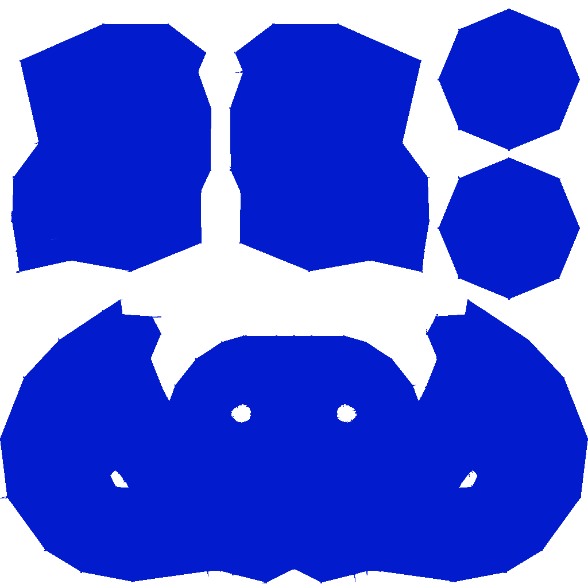

# 🎨 Painterly — Bridging Manual Art & AI Generation

## 🎯 Project Summary

### The Challenge
In game development and 3D visualization, we face a critical challenge:
- Hand-painted "2.5D" textures create beautiful, stylized results but are extremely time-consuming
- Current AI solutions attempt to automate this but often produce inconsistent or unpredictable results
- Artists need a middle ground that combines the control of manual painting with the efficiency of automation

### Our Solution
Painterly is an innovative Blender add-on that bridges this gap by:
- Algorithmically replicating the hand-painting process
- Providing artist-friendly controls for consistent style
- Maintaining the efficiency of automated solutions
- Delivering production-ready, appealing results
  


### Technical Approach
Our solution combines several advanced techniques:
- **Brush Stroke Analysis**: Developed sophisticated algorithms for natural brush stroke generation and placement
- **Contour-Guided System**: Uses mesh geometry and normal maps to guide stroke direction and density
- **UV-Space Optimization**: Intelligent handling of UV space for consistent texture density
- **Normal Map Enhancement**: Custom normal map generation for enhanced depth and detail
- **Real-time Preview**: Efficient GPU-accelerated preview system for immediate feedback

### Key Technical Features
1. **Smart Stroke Generation**
   - Physics-based brush stroke simulation
   - Intelligent stroke placement based on surface features
   - Customizable stroke parameters (width, length, pressure, angle)

2. **Advanced Texture Processing**
   - Multi-layer texture handling
   - Automatic UV space analysis
   - Edge detection and preservation
   - Normal map generation and enhancement

3. **Performance Optimization**
   - Efficient memory management
   - Real-time preview system

We've created a sweet spot between fully manual texture painting and completely automated AI generation, giving artists the best of both worlds.


## ✨ Key Results
Here are some examples of our painterly effects:

### Boat Model

*Color Map with Painterly Effect*


*Normal Map with Painterly Effect*

### Helmet Model

*Color Map with Painterly Effect*


*Normal Map with Painterly Effect*

### Suzanne Model

*Classic Blender Suzanne with Painterly Effect*

## 🌟 Why Painterly?
- 🚀 **Instant Artistic Transformation**: Convert standard 3D models into painterly masterpieces in minutes
- 🎨 **Artist-Friendly Interface**: No programming knowledge required
- 🛠️ **Professional-Grade Results**: Production-ready output with PBR workflow support
- ⚡ **Efficient Workflow**: Reduce production time from days to minutes
- 🔄 **Non-Destructive Editing**: Experiment freely with full undo support

## 🎮 Features

### Artistic Control
- 🖌️ Customizable brush parameters for unique styles
- 🎯 Precise control over stroke placement and density
- 🌈 Enhanced normal maps for stunning 2.5D effects
- 🔍 Detail preservation with intelligent stroke placement
- 🧬 Seamless UV space handling

### Technical Excellence
- ⚙️ PBR workflow compatibility
- 📐 Advanced normal map generation
- 🔲 Smart edge detection and handling
- 🎯 Object-aware stroke placement
- 🔄 Batch processing support

## 👩‍💻 Personal Contributions

### Research and Development
I conducted extensive research into texture generation approaches:
- Evaluated existing AI solutions (BlenderMCP, Meshy.ai) and identified their limitations
- Explored text-to-texture generation capabilities and their practical applications
- Found that procedural approaches often provide better artistic control and consistent results
- Validated our approach against current market solutions

### Technical Implementation
- Developed core Blender add-on infrastructure for seamless integration
- Created an intuitive parameter system for brush customization
- Implemented real-time preview functionality
- Optimized texture generation pipeline for better performance

### Comparative Analysis
Through extensive testing, I found that while AI solutions like BlenderMCP and Meshy.ai offer interesting features, they often lack:
- Consistent style maintenance across textures
- Fine-grained artistic control
- Predictable results
- Real-time preview capabilities

Our procedural approach provides better results in these areas, offering a sweet spot between manual painting and fully automated AI solutions.

### Lessons Learned
- Discovered that combining traditional graphics techniques with modern tools yields superior results
- Gained deep understanding of texture generation pipelines
- Learned the importance of user-centric design in technical tools
- Realized that sometimes simpler, more controlled approaches outperform complex AI solutions
- Developed appreciation for the balance between automation and artistic control

## 🚀 Getting Started

### System Requirements
- Blender 2.93 or higher
- 8GB RAM minimum (16GB recommended)
- Graphics card with OpenGL 4.5 support

### Installation
1. Download the latest release
2. In Blender:
   - Navigate to Edit > Preferences > Add-ons
   - Click "Install" and select the downloaded `painterly.zip`
   - Enable "Painterly" in the add-ons list
3. Access Painterly in the N-panel (press N)

### Quick Start Guide
1. Select your 3D model
2. Open Painterly panel (N-panel)
3. Choose a preset or adjust parameters
4. Click "Apply" to generate effect
5. Fine-tune as needed

## ⚙️ Parameter Guide

### Brush Settings
| Parameter | Default | Description |
|-----------|---------|-------------|
| Width | 30-50 | Controls stroke width variation |
| Length | 40-80 | Determines stroke length range |
| Angle | 45° | Sets directional variation |
| Edge Noise | 2.0 | Adds natural edge variation |
| Sparsity | 0.001 | Controls stroke density |

### Advanced Options
- **UV Scale**: Adjust stroke size relative to UV space
- **Normal Strength**: Control the depth effect
- **Seed**: Change randomization pattern
- **Quality Steps**: Balance speed vs. quality

## 💡 Pro Tips
1. Start with presets to understand parameter effects
2. Use lower sparsity for detailed areas
3. Combine multiple passes for complex effects
4. Save your favorite parameters as custom presets
5. Enable backface culling for better performance

## 🔧 Development

### Setup Development Environment
```bash
# Clone repository
git clone https://github.com/your-username/painterly.git

# Install dependencies
pip install -r requirements.txt

# Link to Blender addons directory
## Windows
mklink /D "%APPDATA%\Blender Foundation\Blender\<version>\scripts\addons\painterly" "path\to\painterly"

## macOS/Linux
ln -s /path/to/painterly ~/Library/Application\ Support/Blender/<version>/scripts/addons/painterly
```

@ Kaedim Hackathon 2025
