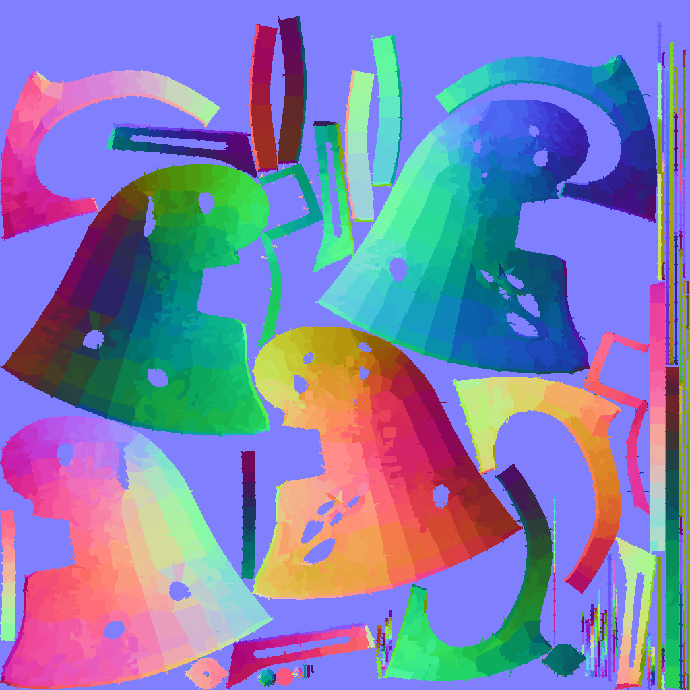

# 🎨 Painterly — Bridging Manual Art & AI Generation

## 🎯 Project Summary

### The Challenge
In game development and 3D visualization, we face a critical challenge:
- Hand-painted "2.5D" textures create beautiful, stylized results but are extremely time-consuming
- Current AI solutions attempt to automate this but often produce inconsistent or unpredictable results
- Artists need a middle ground that combines the control of manual painting with the efficiency of automation

### Our Solution
Painterly is an innovative Blender add-on that bridges this gap by:
- Algorithmically replicating the hand-painting process
- Providing artist-friendly controls for consistent style
- Maintaining the efficiency of automated solutions
  

### Technical Approach
Our solution combines several advanced techniques:
- **Brush Stroke Analysis**: Developed algorithms for natural brush stroke generation and placement
- **Contour-Guided System**: Uses mesh geometry and normal maps to guide stroke direction and density
- **UV-Space Optimization**: Intelligent handling of UV space for consistent texture density
- **Normal Map Enhancement**: Custom normal map generation for enhanced depth and detail

### Key Technical Features
1. **Smart Stroke Generation**
   - Intelligent stroke placement based on surface features
   - Customizable stroke parameters (width, length, angle, color variation)

2. **Advanced Texture Processing**
   - Multi-layer texture handling
   - Automatic UV space analysis
   - Edge detection and preservation
   - Normal map generation and enhancement

We've created a sweet spot between fully manual texture painting and completely automated AI generation, giving artists the best of both worlds.

## ✨ Key Results
Here are some examples of our painterly effects:

### Boat Model

*Color Map with Painterly Effect*

*Normal Map with Painterly Effect*

### Helmet Model

*Color Map with Painterly Effect*

*Normal Map with Painterly Effect*

### Suzanne Model

*Classic Blender Suzanne with Painterly Effect*

## 🌟 Why Painterly?
- 🚀 **Instant Artistic Transformation**: Convert standard 3D models into painterly masterpieces
- 🎨 **Artist-Friendly Interface**: No programming knowledge required
- ⚡ **Efficient Workflow**: Reduce production time from days to minutes

## 🎮 Features

### Artistic Control
- 🖌️ Customizable brush parameters for unique styles
- 🌈 Enhanced normal maps for stunning 2.5D effects
- 🔍 Detail preservation with intelligent stroke placement

## 🚀 Getting Started

### Installation
1. Clone repository and zip /painterly directory OR download painterly.zip
2. In Blender:
   - Navigate to Edit > Preferences > Add-ons
   - Click "Install" and select the downloaded `painterly.zip`
   - Enable "Painterly" in the add-ons list
3. Access Painterly in the N-panel (press N)

### Quick Start Guide
1. Open Blender (from command line is recommended for progress logs)
2. Select your 3D model
3. Open Painterly panel (N-panel)
4. Choose a preset or adjust parameters
5. Click "Apply" to generate effect
6. In Shading tab, create normal map + Image texture blocks and connect to Principle BSDF (or replace existing normal map with generated map)
7. Fine-tune as needed

## ⚙️ Parameter Guide

### Brush Settings
| Parameter | Default | Description |
|-----------|---------|-------------|
| Width | 30-50 | Controls stroke width variation |
| Length | 40-80 | Determines stroke length range |
| Theshold Angle | 10° | Threshold angle between faces to paint over edge |
| Color Variation | 0.0 | Adds slight color variation to texture map |
